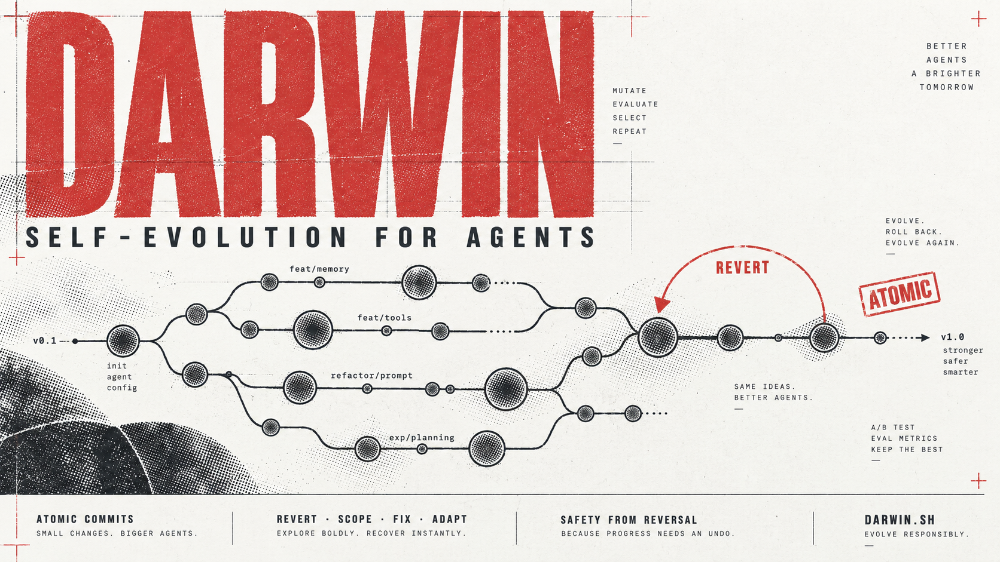

# Darwin

Darwin is an agentic self-evolution framework that enables AI coding assistants to safely modify,
correct, and evolve their own configuration, skills, and knowledge base.

```bash
darwin.sh fix knowledge/cards/foo.md "root cause was wrong, actually shell builtin shadowing" < /dev/null
```

The command stages only the named files, records an atomic git commit with provenance metadata,
appends a 6-column audit entry to `DARWIN.md`, and prints the short hash. Running `git revert <hash>`
cleanly undoes that single modification without disturbing unrelated files.

Safety does not come from cumbersome pre-approval or heavyweight synthetic benchmarks. It comes
from **low undo cost**: every modification is an isolated atomic commit that `git revert` can undo
instantly.

Darwin governs two foundational assets:

1. **Skills**: Procedural workflows defining *how* to execute complex tasks. A defective skill
   immediately degrades agent performance across all future sessions.
2. **Knowledge Notes**: Empirical records of pitfalls, system quirks, and hard-won facts (*what is true*).
   An inaccurate note silently misdirects agents without triggering runtime syntax errors.

---

## Why There Is No Validation Gate

In Google Research's WikiSkill paper (*arXiv 2608.27454*, August 2026), proposed skill edits are
benchmarked against a held-out validation dataset and accepted only if test scores improve over the
historical best. Across five benchmarks, that loop elevated average task accuracy from 49.5% to 68.1%.

However, running a formal validation gate requires three prerequisites:
1. A deterministic, repeatable task suite,
2. An automated scoring oracle, and
3. A large execution token budget.

Personal coding environments lack all three. Darwin inverts the design: **it does not gate
modifications in advance, but keeps every change exactly one atomic `git revert` away.**

---

## Core Pillars of the Modern Architecture

### 1. Dual-Track Provenance (`src=user` vs `src=auto`)

A persistent failure mode in autonomous evolution occurs when a subsequent agent misdiagnoses an
issue and reverts a rule that was explicitly commanded by the human user.

Darwin solves this with strict provenance tracking via the `--user` flag:

- **`src=user` (User-Directed)**: Triggered when the human user explicitly commands a correction or rule
  (*"remember this"*, *"this card is wrong"*, *"never run X"*).
  > [!IMPORTANT]
  > **The Authority Law**: Future agents are strictly forbidden from reverting a `src=user` commit
  > on their own. Only human operators may revoke user-directed evolutions.
- **`src=auto` (Autonomous)**: Hypotheses formed by the agent during routine task execution and
  trial-and-error. Subsequent agents are fully empowered to audit, scope, or revert `auto` commits
  when runtime counter-evidence emerges.

### 2. Ambient Execution vs On-Demand Skill

Darwin supports two complementary operational pathways:

- **The Ambient / Silent Loop**: Rather than consuming context window tokens by summoning an active
  skill on every minor turn, the core classification rules reside in the global instruction file
  (e.g., `AGENTS.md`). At the conclusion of a session, the agent silently checks if any skill was
  bypassed (`adapt`), any guidance proved incorrect (`revert`/`fix`/`scope`/`retract`), or non-obvious
  knowledge was gained (write card), executing `darwin.sh` without nagging the user.
- **The On-Demand Skill (`SKILL.md`)**: Provided for external agents or specialized deep debugging
  sessions where explicit step-by-step guidance is required.

### 3. Non-Blocking Subshell Execution

Agents routinely invoke tools inside non-interactive subshells where standard input (`fd 0`) is
neither an interactive TTY nor an ordinary file stream. In such environments, naive `cat` calls
block indefinitely waiting for EOF, causing the entire agent session to freeze.

`darwin.sh` implements safe file descriptor inspection: if `fd 0` is not a pipe or file with content,
it skips stdin reading entirely. Agents can safely pipe `< /dev/null` for guaranteed non-blocking
execution.

---

## Four-Step Evolution Workflow

Every self-evolution change follows an explicit four-step sequence before touching files:

### 1. Blame the Line

Gather two historical facts before modifying any governed file:

```bash
git log -S'<the wrong sentence, verbatim>' --oneline -- <file>
grep '<file>' DARWIN.md | tail -5
```

The pickaxe search (`-S`) locates the commit that *introduced* the faulty text, rather than the one
that merely touched the line last. The grep command verifies whether this file was previously reverted.
Modifying a file without knowing both facts risks repeating an error that was already diagnosed and undone.

### 2. Classify

Blame output maps to one of five mutually exclusive actions:

| Blame result | Action | Policy |
|---|---|---|
| Introduced by one of the last few edits | `revert` | The previous change relied on incorrect information |
| Present since creation, environment changed | `scope` | Add a version or date boundary; preserve existing content |
| Present since creation, wrong when written | `fix` | Correct the inaccurate claim |
| Upstream wording does not fit this host | `adapt` | Adjust for local platform differences |
| History shows this was previously reverted | **Stop** | Inspect the prior commit message before taking any action. Escalate to human |

### 3. Act

Skills and knowledge notes demand fundamentally different handling:

- **Skills require revert before direct edits**: A modified skill immediately alters agent behavior
  across all future sessions. When a skill misbehaves, revert the introducing commit. Edit a skill
  directly only when the entire procedure is inapplicable to the local environment.
- **Knowledge notes receive paragraph-level retractions (`retract`)**: Keep the file and keep its entry
  in `INDEX.md`. Rewrite only the inaccurate paragraph: *"previously claimed X, which does not hold, because Y"*.
  **The symptom description must remain intact**: Symptoms represent direct observations and serve as
  the primary retrieval key. Root causes represent inferences and constitute the part that fails.
  Deleting the entire note discards the record of the failure and guarantees that future agents will
  fall into the same pitfall again.
- **Anti-fragmentation**: Before creating a new card, run `grep -i <topic> INDEX.md`. Extend or refine
  an existing card instead of creating isolated duplicates.

### 4. Log

Record the modification through `darwin.sh`:

```bash
darwin.sh [--user] <action> <file> [more files...] <one-line-why> < /dev/null
```

Pass all files that belong to a single logical change in one invocation. For example, creating a
knowledge note requires both the new note file and its corresponding line in `INDEX.md`. Committing
them separately allows a subsequent revert of the note file to leave behind a dangling index reference.

Detailed diagnostic context can be piped through standard input:

```bash
cat << 'EOF' | darwin.sh fix knowledge/cards/foo.md "root cause was wrong, actually shell builtin shadowing"
Investigation showed that /usr/bin/log remained accessible.
The failure occurred because zsh defines a builtin named log.
The previous note incorrectly blamed macOS permissions.
EOF
```

---

## The Audit Log (`DARWIN.md`)

`DARWIN.md` maintains an append-only log with six columns per entry:

```
date        commit   src   action  target                  one-line reason
2026-09-01  a1b2c3d  auto  new     cards/zsh.md +1         zsh builtin shadows /usr/bin/log; note and index line
2026-09-02  d4e5f6a  auto  adapt   skills/deploy.md        upstream assumes GNU coreutils, this host has BSD
2026-09-03  b7c8d9e  auto  fix     cards/zsh.md            root cause was shell builtin shadowing instead of permissions
2026-09-03  c9d0e1f  auto  revert  skills/deploy.md        undoes d4e5f6a: failure was a stale PATH instead of BSD tools
2026-09-04  e2f3a4b  auto  scope   cards/driver.md         empty-tree finding applies to Safari; Chrome untested
2026-09-06  f8a12bc  user  revert  skills/deploy.md        user explicitly commanded removing hook; agent cannot override
```

The one-line reason must answer a specific question depending on the action:

- `fix`: What the original claim got wrong, preventing a later agent from reintroducing the error.
- `revert`: Name the undone commit hash and state why the original evidence was false.
- `adapt`: State the concrete environment discrepancy that required the adjustment.
- `scope`: Define the new boundary or condition.
- `retract`: Identify which paragraph was withdrawn.

Full narratives belong in the commit body, retrieved with `git show <hash>` only when needed.

---

## Knowledge Notes Subsystem

The `knowledge/` directory stores structured records of hard-won facts and operational pitfalls.
A flat index file (`knowledge/INDEX.md`) containing one summary line per note serves as the entire
retrieval mechanism.

There are no vector databases, no text embeddings, and no multi-stage retrieval workflows. The full
index loads into the agent context at the start of each session. If an index line matches the current
task, the agent opens that single file; if nothing matches, execution proceeds immediately without
secondary search.

---

## Skill Distribution & Atomic History Protection

### Symlink Distribution (`sync-skills.sh`)
Different agent CLIs expect skills in separate directories (`~/.claude/skills`, `~/.codex/skills`,
`~/.cursor/skills`, etc.). `sync-skills.sh` symlinks a single canonical skill repository into each
agent location, ensuring that an evolved skill takes effect everywhere simultaneously while keeping
only one file to roll back.

### Protecting Atomic History (`sync-guard.sh`)
Standard configuration sync scripts often run `git add -A` before pushing updates. That pattern
destroys Darwin: an uncommitted evolution edit gets bundled into a batch commit alongside unrelated
files. Later, running `git revert` on that commit forces unrelated files to roll back as well.

`sync-guard.sh` inspects governed paths before any batch commit runs. If changes exist in skills,
guidance files, or knowledge notes that did not pass through `darwin.sh`, the script blocks the commit:

```bash
sync: refusing to commit, 2 governed files have not gone through darwin.sh:
 M knowledge/cards/foo.md
 M knowledge/INDEX.md
sync: run darwin.sh [--user] <action> <file> <one-line-why> on each, then sync again.
```

---

## When to Stop (Thrash Detection)

Editing frequently remains safe only when changes converge. Inspect the log for thrashing:

```bash
grep -cE "  (revert|fix)  <file> " DARWIN.md
```

If the log records two reverts on the same file, or three fixes while the issue persists, the root
cause remains unidentified. Continuing to edit at that stage produces circular modifications. Stop
and escalate the issue to a human operator.

`adapt` actions do not count toward this threshold: adapting upstream skills to local environment
constraints is routine maintenance that occurs repeatedly.

---

## Installation

Clone the repository and install the helper script into your configuration repository:

```bash
git clone https://github.com/Anson-gzy/darwin.git
cp darwin/darwin.sh ~/.agents/darwin.sh
chmod +x ~/.agents/darwin.sh
cp darwin/sync-guard.sh ~/.agents/sync-guard.sh
chmod +x ~/.agents/sync-guard.sh
cp darwin/SKILL.md ~/.agents/skills/darwin/SKILL.md
```

Add a concise self-evolution directive to whichever instruction file loads into context on every session:

```markdown
## Self-Evolution

Knowledge notes and skills can be corrected on the spot.
1. Silent Path: If an upstream skill had to be bypassed, adapt it; if a note was wrong, blame and retract/fix/revert; if a hard pitfall took >= 2 tries, write a note. Run `darwin.sh <action> <files...> <why> < /dev/null`.
2. User-Directed: When the user points out a correction, run `darwin.sh --user <action> <files...> <why> < /dev/null`. Never revert a `src=user` change autonomously.
```

---

## Limitations

Darwin performs no scoring or automated measurement. It documents what changed and provides an undo
path, but cannot prove that configuration quality improved.

Darwin also inherits an unresolved challenge documented in the WikiSkill research: skills evolved
against one model can degrade the performance of another. Darwin cannot detect cross-model degradation;
the only available defense is documenting explicit applicability conditions directly within the rule text.

---

## License

MIT
